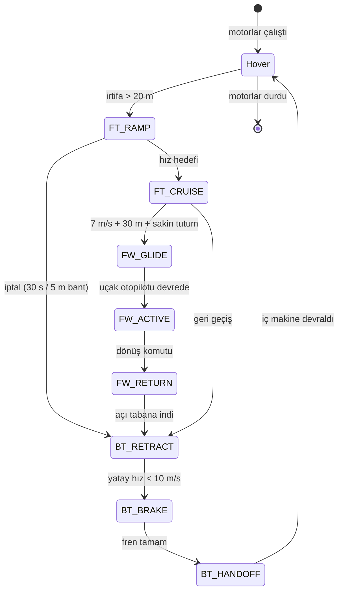

# Genel Bakış

> Bu doküman projeyi hiç bilmeyen birine tümüyle anlatır. Ön koşul yoktur.
> Belirli bir konuyu derinlemesine anlatan seviye dokümanları ayrıdır.

## 1. Tek cümle

Bu proje, dikey kalkıp helikopter gibi havada asılı durabilen, sonra üç motorunu
da öne çevirip uçak gibi hızla ilerleyebilen 5 kilogramlık bir insansız hava
aracının, bu iki uçuş biçimi ve aralarındaki geçiş boyunca havada kalmasını
sağlayan uçuş kontrol yazılımıdır.

## 2. Hangi problem

Havada asılı durabilen bir araç yavaş ve menzilsizdir; hızlı ve menzilli bir araç
ise piste muhtaçtır. İkisini birden isteyen bir görev — bir noktadan pistsiz
kalkmak, uzağa hızla gitmek, orada tekrar asılı durmak — tek bir araçla ancak
motorların yönü uçuş sırasında değiştirilebiliyorsa mümkün olur. Bu aracın üç
motoru da bunu yapar: ikisi kanatların üzerinde, biri kuyruk bomunun ucunda,
hepsi 0 ile 90 derece arasında öne yatabiliyor
(`tiltrotor_tailplane_model.sdf:334-338, 465-469, 596-600`).

Sorun, motorları çevirmenin mekanik değil kontrol problemi olmasıdır. Yaygın
otopilot yazılımları bu sınıfta bir aracı zaten destekler, ama destekledikleri
düzen farklıdır: ayrı kaldırma motorları, ayrı itici bir motor, ve sabit
kanatlar. Orada geçiş kolaydır, çünkü geçiş boyunca aracı kimin kontrol ettiği
hiç belirsiz kalmaz — önce kaldırma motorları, sonra bir eşik hızında kontrol
yüzeyleri devralır, ve devir teslim anında her iki taraf da tek başına aracı
tutabilecek durumdadır. Bu araçta öyle bir an yoktur. Üç motor aynı anda hem
kaldırma kuvvetidir, hem ileri itiştir, hem de aracın sahip olduğu kontrol
otoritesinin tamamına yakınıdır. Motorlar yarı yoldayken, aracı tutan başka bir
şey yoktur.

Bunun ikinci ve daha sinsi yüzü şudur: bir motorun ne işe yaradığı sabit
değildir, yattığı açıyla birlikte sürekli değişir. Dikey konumdayken kanat
motorlarının itki farkı aracı yatırır ve burnunu kaldırır. Yatay konumdayken aynı
itki farkı aracı döndürür ve ileri iter. Aradaki her açıda ikisinin karışımıdır.
Klasik otopilot yazılımı bu ilişkiyi bir kere yazılıp bir daha değişmeyen sabit
bir dağıtım tablosuna gömer. Böyle bir tablo bu araçta yalnızca iki uç noktada
doğrudur, aradaki hiçbir yerde değil — ve aracın en savunmasız olduğu yer tam da
o aradır. Üstelik dağıtılacak beş istek (üç eksende döndürme, ileri ve aşağı
kuvvet) karşısında oynatılabilecek on bir şey vardır; hangisinin ne kadarını
üsteleneceği, her birinin kendi sert sınırı ve sınırlı hareket hızı varken, tek
bir tabloyla cevaplanamayacak bir sorudur.

## 3. Neden zor

Naif yaklaşım şudur: her eksen için bir düzeltici döngü kur, çıktıyı sabit bir
tabloyla motorlara dağıt, belli bir hızda kontrolü uçak moduna devret. Bu
projenin yazılı kaydı, bu yaklaşımın tam olarak nerede kırıldığını ölçmüş.

**Aktüatörün ne kadar iş gördüğü sabit değil.** Yazılım motora komut verirken
orantılı davranıyordu; motorun gerçekte ürettiği itki ise karesel bir ilişkiyle
oluşuyor. İki model yalnızca tam gaz noktasında örtüşüyordu. Sonuç: komut başına
gerçekleşen itki değişimi 5 N civarında 0,23 iken 45 N civarında 1,99 —
yaklaşık dokuz kat fark — ama kontrolcü bunu her yerde 1,0 sanıyordu. Bu, itkisi
düşmüş bir motoru daha da aşağı iten kendi kendini besleyen bir döngü yarattı.
Ölçülen sonuç: bir ya da iki kanat motoru sıfıra çöküp orada kilitleniyor,
23 saniyede araç 161,9 derece kontrolsüz dönüyor, dikey hız komut edilen
2,0 m/s'nin 5,5 katına (-11,01 m/s) fırlıyor, bir oturumda araç tamamen ters
dönüyor (`WLS_LOCKUP_INVESTIGATION_REPORT.md:209, 241-243, 419`).

**Kısa test yalan söylüyor.** Yukarıdaki arıza her koşuda ilk 13-17 saniye
boyunca tamamen kararlı görünüyor. Beş on saniyelik bir deneme "çalışıyor"
sonucunu verir. Gerçek arıza 15-25 saniye sonra ortaya çıkar, ve o noktada geri
dönüşü yoktur.

**Kontrolcünün kendi hareketi kendi bozucusu oluyor.** Motorları hızla çevirmek,
çevrilen kütlenin tepkisi olarak aracın gövdesine bir tork uygular. Bu tork
ölçüldü: iki kanat motorunda 0,542 ve 0,531 Nm — kontrolcünün burnu kaldırmak
için ürettiği momentin (yaklaşık 0,47 Nm) sırasıyla %115 ve %113'ü, yani ondan
biraz daha büyük (`WLS_LOCKUP_INVESTIGATION_REPORT.md:7150-7166`). Bu alandaki standart
formülasyon motorun yattığı açıyı durağan bir parametre kabul eder ve bu tepkiyi
hiç modellemez. Yani sorun bir uygulama hatası değil, yöntemin yapısal boşluğu.

**Eksen eksen ayarlamak işe yaramıyor.** Yatma, dönme ve yana kayma birbirine
kenetli tek bir hareket biçimi oluşturuyor. Tek bir eksenin kazancını canlı
denemede artırmak üç bağımsız kez tehlikeli sonuç verdi; bir denemede açısal hız
saniyede 388 dereceye çıktı (`WLS_LOCKUP_INVESTIGATION_REPORT.md:6579`).

**Sınıra aynı anda dayanmak otoriteyi bitiriyor.** İleri geçişte iki kanat motoru
birlikte yatay konuma tırmanırken biri tavana önce çarpıyor; aralarındaki fark
kaybolduğu an aracın yatma kontrolü de kayboluyor, üç motor birden doyuyor ve
araç 30 metreden 300 metrenin üzerine savruluyor
(`WLS_LOCKUP_INVESTIGATION_REPORT.md:7279-7417`).

**Doğru matematik yetmiyor.** Aynı kontrol yasası idealize edilmiş masaüstü
benzetiminde kusursuz çalışırken, gerçek zamanlama sapmaları ve gerçek çok-cisim
fiziği altında kilitlendi (`WLS_LOCKUP_INVESTIGATION_REPORT.md:211-220`).

## 4. Nasıl çalışıyor — bir uçuşu takip et

### 4 milisaniye: bir kontrol adımı

Yazılım bir saat tarafından değil, jiroskoptan gelen ölçümle uyandırılır
(`MulticopterIndiTiltrotor.cpp:220`). Yeni bir dönüş hızı örneği geldiği an
tek bir adım başlar; nominal ritim saniyede 250 kez, yani 4 milisaniyede bir
(`TiltrotorIndiParams.hpp:419`).

İlk iş geçen sürenin ölçülmesi ve 0,125 ms ile 20 ms arasına kelepçelenmesidir
(`MulticopterIndiTiltrotor.cpp:456`); patolojik bir gecikme birikimli hesapları
bozmasın diye. Ardından girdilerin güvenilir olup olmadığına bakılır. Burada
kasıtlı bir hiyerarşi var: aracın hangi yöne baktığı bilgisi kaybolursa çıkış
tamamen kesilir, çünkü ölçülmüş — yalnız dönüş hızını sönümlemeye çalışan bir
kontrolcüyle üç senaryonun üçü de yere çakıldı
(`MulticopterIndiTiltrotor.cpp:540-548, 555-590`). Yükseklik veya konum bilgisi
kaybolursa çıkış kesilmez, sadece o döngüler devre dışı bırakılır
(`MulticopterIndiTiltrotor.cpp:594-638`).

Sonra ne istendiği belirlenir. İstek ya bir test kaynağından ya pilottan gelir ve
aralarında sarsıntısız devralma kuralları vardır
(`MulticopterIndiTiltrotor.cpp:661-837`). Yavaş değişen döngüler — yükseklik
tutma, konum tutma, geçiş makineleri — bu hızda koşmaz, saniyede 50 kez koşar
(`TiltrotorIndiParams.hpp:429`); bunlar aracın nereye gitmesi gerektiğini
söyler, nasıl döneceğini değil.

Şimdi asıl kısım. Aracın şu an ne kadar ivmelendiği ölçülür, ne kadar
ivmelenmesi gerektiği hesaplanır, aradaki fark alınır. Bu farkı kapatmak için
gereken **moment değişimi** çıkarılır. Yanında, saniyede 200 kez güncellenen ayrı
bir tahminci, modelin açıklayamadığı artığı — rüzgâr, modelleme hatası, o
modellenmemiş tepki torku — bir bozucu olarak sürekli kestirir ve talebe ekler
(`MulticopterIndiTiltrotor.cpp:1402-1423`). Buradaki püf nokta, hesabın mutlak
bir komut değil bir **değişim** üretmesidir: "şu anki durumdan şu kadar daha
fazla" der.

Bu değişimin on bir oynatılabilir şeye dağıtılması gerekir: üç itki, üç motor
açısı, beş kontrol yüzeyi (`TiltrotorIndiParams.hpp:55`). Karşılığında karşılanacak
istek beş tanedir, yani sonsuz çözüm vardır ve en ucuzunu seçmek gerekir. Ucuzluk
iki katmanlı tanımlanır: hangi isteğin daha önemli olduğu (yatma ve burun açısı
yüksek, dönme ve ileri kuvvet düşük) ve hangi aktüatörü kullanmanın daha pahalı
olduğu — motor açısını oynatmak asılı duruşta pahalı, hız arttıkça ucuzlar
(`sf_wls_alloc.m:67-95`).

Dağıtımdan önce her aktüatöre bu tek adımda ne kadar oynayabileceğini söyleyen
bir kutu konur. Motor açıları için bu kutu 3,00 rad/s hıza karşılık gelir, yani
adım başına 0,012 radyan (`TiltrotorIndiParams.hpp:420`). Kutu bilinçli olarak
o adımda ölçülen süreyle değil, nominal 4 milisaniyeyle boyutlandırılır; ölçülen
süreyle boyutlandırmak gerçek otoriteyi yüzde 62'ye düşürüyordu
(`MulticopterIndiTiltrotor.cpp:1444, 1530-1534`). Buna ek olarak motor açısının
ne kadar hızlı *hızlanabileceği* de ayrıca sınırlanır — saniyede 0,3 radyan
(`MulticopterIndiTiltrotor.cpp:103`) — çünkü §3'te anlatılan tepki torkunun
kaynağı tam olarak budur.

Çözücü ağırlıklı bir en iyi dağıtımı kapalı formda hesaplar, sınırını aşan
aktüatörleri bulur, onları kendi sınırlarına çivileyip yeniden çözer. En fazla on
bir tur döner, çünkü her tur en az bir aktüatörü sabitler ve geri alma yoktur —
bu, en kötü durumda ne kadar süreceğinin baştan bilinmesini sağlar
(`TiltrotorIndiControl.hpp:206-245`).

Çıkan sonuç bir değişimdir; mutlak komut, "şu anki durum" ile toplanarak bulunur.
Peki şu anki durum nereden biliniyor? Bilinmiyor. Bu otopilotta servolardan ve
motor sürücülerden konum geri beslemesi yoktur. Bu yüzden yazılım aktüatörlerin
nerede olduğuna dair kendi modelini taşır ve her adımda ileri taşır
(`MulticopterIndiTiltrotor.cpp:1662-1728`). Bu modelin gerçekçiliğini artırmak
için servo sürtünmesi eklenmesi denenmiş ve geri alınmış: kapalı çevrimde
kilitlenme üretiyordu — ve bu yalnızca kapalı çevrim testte görüldü
(`MulticopterIndiTiltrotor.cpp:1668-1716`).

Son olarak itki komutu, motorun karesel davranışının tersi alınarak normalize
edilir (`MulticopterIndiTiltrotor.cpp:1605-1606`, `TiltrotorIndiControl.hpp:347`) — §3'teki kilitlenmenin
çözümü tam olarak budur — yüzey ve açı komutları yayınlanır
(`MulticopterIndiTiltrotor.cpp:1626-1657`), ve bir tanı paketi loglanır. Adım
biter, jiroskop tekrar konuşur.

### 20 dakika: bir uçuş

Araç asılı duruşta başlar. Yukarıdaki adım saniyede 250 kez döner; konum tutma
döngüsü devrededir, çünkü onsuz dönme trimi kaçınılmaz olarak yaklaşık 3 N ileri
kuvvet üretir ve araç 25 saniyede 235 metre sürüklenir — bu döngüyle sürüklenme
ortalama 6 santimetreye iner (`WLS_LOCKUP_INVESTIGATION_REPORT.md:28`).

İleri geçiş komutu geldiğinde önce bir kapı vardır: en az 20 metre irtifa
(`TiltrotorIndiParams.hpp:722`). Geçiş başlar ve motor açıları öne yatmaya
başlar, ama 45 dereceden ileri gitmelerine izin verilmez. Bu tavan bir ağırlık
değil, sert bir yasaktır; hiçbir ağırlık oranı yükseklik kanalının aracı öne
yatırma güdüsünü dengeleyemedi (`MulticopterIndiTiltrotor.cpp:105-135, 137-182`).
Geçiş 30 saniyede bitmezse ya da irtifa 5 metrelik banttan çıkarsa geçiş
iptal edilir ve aynı adımda geri dönüş başlar
(`TiltrotorIndiParams.hpp:714, 721`).

Hız yeterince artınca ikinci bir kapı açılır: 7 m/s hız, 30 metre irtifa,
10 dereceden az yatma, saniyede 10 dereceden az dönme
(`TiltrotorIndiParams.hpp:890-905`). Bu kapıdan geçildiğinde yukarıda anlatılan
tüm iç makine — fark hesabı, bozucu tahmincisi, dağıtım çözücüsü — tamamen devre
dışı kalır ve yerini konvansiyonel bir uçak otopilotu alır
(`MulticopterIndiTiltrotor.cpp:1306-1376`). Bu, mimarideki en büyük tekil
karardır ve kolay verilmemiştir: aracı tek bir birleşik kontrolcüyle uçurma
girişimleri her denemede aynı tehlikeli yatık dönüş dengesine, bazen tam ters
dönmeye yerleşti. Çözüm, dönmek için aracı yatırmak — yani uçakların yaptığı şey
(`RUNBOOK.md:1150-1171`).

Dönüş yolunda geri geçiş üç kademelidir. Motor açıları geri çekilir, araç
frenler, sonra kontrol tekrar iç makineye devredilir. Buradaki tavan zamana değil
ölçülen yatay hıza bağlanmıştır (referans 12 m/s, `TiltrotorIndiParams.hpp:546`), çünkü araç hâlâ hızlıyken
pervaneleri dikeye çevirmek gerçek donanımda pervaneyi kırabilir — benzetimin
idealize edilmiş modeli bu riski göstermez
(`WLS_LOCKUP_INVESTIGATION_REPORT.md:7421-7471`). Uçak modundan asılı duruşa
dönüş de aynı sebeple kademelidir: ilk deneme, donmuş durumu bir anda iç makineye
devretmişti ve araç 1 saniyede 173,6 derece yatarak takla attı
(`WLS_LOCKUP_INVESTIGATION_REPORT.md:7475-7524`).

## 5. Ana parçalar

Yukarıda hepsi iş başında görüldü; şimdi adlarıyla:

| Parça | Sorumluluğu | Yapmadığı |
|---|---|---|
| `MulticopterIndiTiltrotor.{hpp,cpp}` | Uçuş modülünün kendisi: adımı sürer, girdileri doğrular, döngüleri ve faz makinelerini koşturur, aktüatörleri yayınlar | Dağıtım matematiğini kendi içinde çözmez; görev/rota planlaması yapmaz |
| `TiltrotorIndiControl.hpp` | Dağıtım çözücüsü ve kontrol yasası yardımcıları — sınır ihlali bulup çivileyerek yineleyen sabit boyutlu çözüm | Uçuş fazlarını ya da güvenlik kararlarını bilmez |
| `TiltrotorIndiParams.hpp` | Uçan taraftaki tüm sabitler: geometri, limitler, eşikler, ritimler | Çalışma anında değişmez; ayarlanabilir parametre sistemi değildir |
| `TiltrotorIndi{Setpoint,Status}.msg` | Test isteklerinin girişi ve tanı çıktısının sözleşmesi | Kontrol yolunun parçası değildir; yalnız veri biçimidir |
| `indi_attitude_controller.m`, `sf_wls_alloc.m`, `altitude_loop.m` | Aynı kontrol yasasının masaüstü karşılığı: tasarımın geliştirildiği ve riskli fikirlerin önce denendiği yer | Uçan kod değildir; otomatik olarak C++'a çevrilmez |
| `tiltrotor_params.m` | Fiziksel ve kontrol parametrelerinin masaüstü tarafındaki tek kaynağı | Uçan sabitlerle otomatik senkron değildir — elle tutulur |
| `tiltrotor_plant_deriv.m` | Kontrolcünün karşısına konan sahte gerçeklik: gövde dinamiği, aktüatör gecikmesi, aero | Gerçek fiziği temsil etmez; eksiklikleri bilinçlidir |
| `tiltrotor_tailplane_model.sdf` | Benzetimdeki aracın kendisi: kütle, geometri, eklemler, kanat panelleri | Kontrol mantığı içermez |
| `sitl_experiments/` | Benzetimde gözlenen bir olayı masaüstünde güvenle yeniden üretme koşumları ve log-model karşılaştırma araçları | Benzetimi kendisi başlatmaz; `run_*.m` dosyaları saf masaüstü koşumudur |
| `RUNBOOK.md`, `WLS_LOCKUP_INVESTIGATION_REPORT.md` | Kurulum/koşum talimatı ve tarihli araştırma günlüğü; "neden böyle yapıldı" bilgisinin ana kaynağı | Kodun kendisinden türetilebilecek bilgiyi tekrarlamaz |

## 6. Önemli kararlar

| Karar | Alternatif | Neden bu |
|---|---|---|
| Aktüatör dağıtımı her adımda yeniden çözülüyor | Sabit dağıtım tablosu | Bir aktüatörün ne işe yaradığı motor açısıyla ve itki seviyesiyle sürekli değişiyor; tablo yalnız iki uç noktada doğru |
| Yazılım aktüatörlerin nerede olduğunu kendi modelinden takip ediyor | Servo/motor konum geri beslemesi | Otopilotta böyle bir geri besleme yok, ama artımlı kontrol yasası "şu an neredeyiz" bilgisi olmadan çalışamaz |
| Motor açısı tavanı ağırlık değil sert kısıt | Ağırlıklarla caydırmak | Hiçbir ağırlık oranı yükseklik kanalının aracı öne yatırma güdüsünü dengeleyemedi (`MulticopterIndiTiltrotor.cpp:105-135`) |
| Uçak modu iç kontrol makinesini tamamen atlıyor | Tek birleşik kontrolcü | Birleşik denemeler her seferinde aynı tehlikeli yatık dönüşe, bazen ters dönmeye yerleşti (`RUNBOOK.md:1150-1171`) |
| Sınır kutuları ölçülen süreyle değil nominal 4 ms ile boyutlanıyor | Gerçek adım süresini kullanmak | Gerçek süreyle boyutlandırma aracın kullanılabilir otoritesini %62'ye düşürüyordu (`MulticopterIndiTiltrotor.cpp:1530-1534`) |

## 7. Kapsam dışı

- **Gerçek donanımda uçuş.** Yazılı kayıt bunu sürekli olarak uçuşa uygun
  bulmuyor. İtki eşlemesi benzetimin motor modeline kalibre edilmiştir ve gerçek
  motor/pervane için yeniden türetilmesi gerekir
  (`WLS_LOCKUP_INVESTIGATION_REPORT.md:29, 313`).
- **Genel amaçlı bir VTOL kontrolcüsü değil.** Tek bir gövdeye, tek bir geometriye
  ve tek bir motor yerleşimine bağlıdır.
- **Görev ve rota planlaması yok.** Modül kendisine verilen hedefleri uygular;
  nereye gidileceğine karar veren üst katman bu deponun dışındadır.
- **Rüzgâr altında geçiş doğrulanmadı.** Asılı duruşta dönme kriteri bozucu ve
  geçiş senaryolarında hiç test edilmedi.
- **Motor çevirmenin tepki torku hâlâ modellenmiyor.** Bu etki şu an aracın
  çevirme hızını sınırlayarak bastırılıyor; yazılı kayıt asıl çözümün onu
  dağıtım hesabının içine açıkça eklemek olduğunu, bunun ise daha büyük bir
  değişiklik olduğunu söylüyor (`WLS_LOCKUP_INVESTIGATION_REPORT.md:7195`).
- **Açık kalmış bir arıza var:** konum tutma ile eşzamanlı tırmanma sırasında
  dönme ekseninde sönmeyen bir salınım oluşuyor; kök neden bulunamadan
  kayıt altına alınıp bırakıldı (`RUNBOOK.md:1348-1367`).
- **Benzetimi başlatan sürücüler burada değildir.** Masaüstü koşumlarının
  ihtiyaç duyduğu MATLAB zinciri depoda tamdır, ama `RUNBOOK.md`'de adı geçen
  ve gerçek uçuşları başlatan betikler (`smoke_test.py`,
  `run_transition_test.py` ve diğerleri) ayrı bir dizinde durur. Aynı şekilde
  uçuş yazılımının derlenen kopyası da burada değil, otopilot ağacındadır; bu
  depodaki `.cpp`/`.hpp` dosyaları o ağaca kopyalanan kaynaktır.

## 8. Nereden devam

**Kodu okumaya başlanacak yer.** Tek bir kontrol adımının tamamı
`MulticopterIndiTiltrotor.cpp:433` içindedir; baştan sona okunduğunda sistemin
iskeleti çıkar. Dağıtım çözücüsü ayrı ve kısadır:
`TiltrotorIndiControl.hpp:206`. Sistemi şekillendiren sayılar
`TiltrotorIndiParams.hpp:415-429` civarında yoğunlaşır. Masaüstü tarafından
başlamak tercih edilirse `indi_attitude_controller.m` aynı yasanın daha okunur
bir anlatımıdır.

**Derleme ve koşum.** Adımlar `RUNBOOK.md` §0-6'dadır. Dikkat edilmesi gereken
nokta, komutların bu depoda değil otopilot ağacının içinde koşmasıdır: bu depo
kaynak dosyaların bir kopyasını tutar, derlenen ise ağaçtaki kopyadır. Sıra
şudur — ön koşul kontrolü, derleme (`make px4_sitl_default`), benzetimi
`gz_tiltrotor_indi` modeliyle başlatma, sonra uçuşu sürükleyen test
betiklerinden birini çalıştırma. Betikler otopilot istemcilerini çıplak adla
çağırdığı için derlenmiş `bin` dizini `PATH`'e eklenmiş olmalıdır.

**Masaüstü koşumları.** `sitl_experiments/` içindeki denemeler MATLAB'da tek
başına çalışır, benzetim gerektirmez. Arama yoluna hem depo kökü hem
`sitl_experiments/` eklenmelidir; koşumlar yalnız kendi dizinlerini eklediği
için kökü çağıran tarafın vermesi gerekir.

**Derinleşmek için.** `RUNBOOK.md`'nin ilk bölümü kurulum ve beklenen çıktı
tablosudur; 840. satırdan sonrası tarihli araştırma günlüğüne dönüşür.
`WLS_LOCKUP_INVESTIGATION_REPORT.md` tek bir arızanın kök nedenine inen uzun
soruşturmadır ve bu projedeki yöntem derslerinin çoğu oradadır.

---

### Açık sorular

- [BELİRSİZ: Bu çalışma resmi olarak bir tez/yayın kapsamında mı, yoksa bağımsız
  bir geliştirme mi? Belgeler bunu açıkça söylemiyor.]
- [BELİRSİZ: `sitl_experiments/` içindeki log-model karşılaştırma araçlarının
  gerçek sayısal çıktısı (korelasyon, oran) depoda yok — yalnız hesaplama yöntemi
  var. Bu karşılaştırmaların sonucu neydi?]
- [BELİRSİZ: `tiltrotor_params.m` içindeki geçiş ve enerji yönetimi
  parametrelerini hangi dosyalar tüketiyor? Onları çağıran modüller bu depoda
  yok.]
